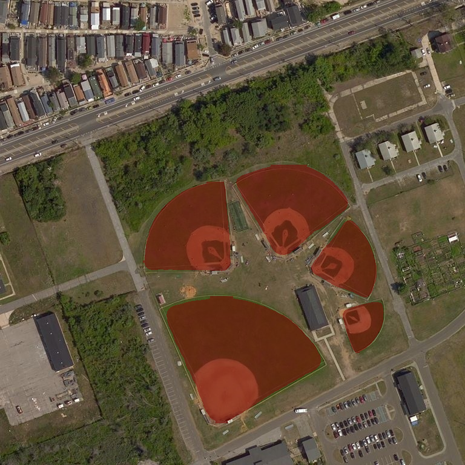
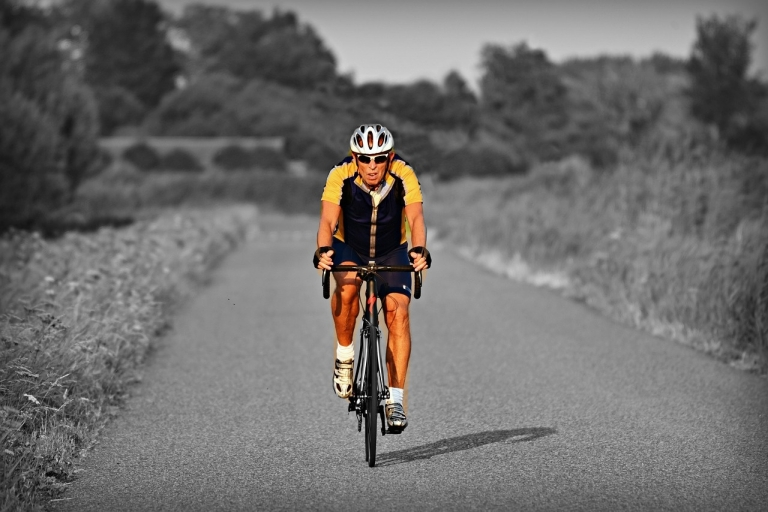

# Mask R-CNN for Object Detection and Segmentation

This is an implementation of [Mask R-CNN](https://arxiv.org/abs/1703.06870) on Python 3.7.9, Keras2.3.1, and TensorFlow 1.14. The model generates bounding boxes and segmentation masks for each instance of an object in the image. It's based on Feature Pyramid Network (FPN) and a ResNet101 backbone.

The repository includes:
* Source code of Mask R-CNN built on FPN and ResNet101 including ParallelModel class for multi-GPU training
* Jupyter notebooks to visualize the detection pipeline at every step
* IceData dataset is from NRC OCRE Magne Viking model testing
* Architecture to extract the following from each proposed detection and save into a CSV file for future training
    *   Mask centroid
    *   Position in user-defined cylindrical polar user-defined coordinate "grid"; the purpose of which is to extract model statistics (Floe area distribution, and ice concentration in each region)
* Beginning of an RNN training area to train a RNN model on the ice-ship data to predict ice collision forces.
* The entire repo is built to predict ice-ship collision forces from an optical sensor (overhead camera feed in this implementation). The three stage process to do so is here.
    *   MRCNN used for semantic segmentation of ice/ship images
    *   Extraction of data from MRCNN model into statistics (saved as CSV files)
    *   RNN training architecture to predict ice collision forces.


The code is documented and designed to be easy to extend. If you use it in your research, please consider citing this repository (bibtex below). If you work on 3D vision, you might find our recently released [Matterport3D](https://matterport.com/blog/2017/09/20/announcing-matterport3d-research-dataset/) dataset useful as well.
This dataset was created from 3D-reconstructed spaces captured by our customers who agreed to make them publicly available for academic use. You can see more examples [here](https://matterport.com/gallery/).

## Citation
Use this bibtex to cite the original Matterport MRCNN repo:
```
@misc{matterport_maskrcnn_2017,
  title={Mask R-CNN for object detection and instance segmentation on Keras and TensorFlow},
  author={Waleed Abdulla},
  year={2017},
  publisher={Github},
  journal={GitHub repository},
  howpublished={\url{https://github.com/matterport/Mask_RCNN}},
}
```
Use this bibtex to cite the original Matterport MRCNN repo:
```
@misc{LPalmer_MRCNN_RNN_iceCollisionFocePrediction,
  title={Mask R-CNN for object detection and instance segmentation on Keras and TensorFlow Compatible with Tensorflow 1.14x - personal workings},
  author={Waleed Abdulla AND Ahmed Gad AND Logan Palmer},
  year={2023},
  publisher={Github},
  journal={GitHub repository},
  howpublished={\url{https://github.com/lrpalmer27/MASK_RCNN_TF1.x}},
}
```

## 1. Anchor sorting and filtering
Visualizes every step of the first stage Region Proposal Network and displays positive and negative anchors along with anchor box refinement.


## 2. Bounding Box Refinement
This is an example of final detection boxes (dotted lines) and the refinement applied to them (solid lines) in the second stage.


## 3. Mask Generation
Examples of generated masks. These then get scaled and placed on the image in the right location.


## 4.Layer activations
Often it's useful to inspect the activations at different layers to look for signs of trouble (all zeros or random noise).


## 5. Weight Histograms
Another useful debugging tool is to inspect the weight histograms. These are included in the inspect_weights.ipynb notebook.


## 6. Logging to TensorBoard
TensorBoard is another great debugging and visualization tool. The model is configured to log losses and save weights at the end of every epoch.


## 6. Composing the different pieces into a final result


# Training on MS COCO
We're providing pre-trained weights for MS COCO to make it easier to start. You can
use those weights as a starting point to train your own variation on the network.
Training and evaluation code is in `samples/coco/coco.py`. You can import this
module in Jupyter notebook (see the provided notebooks for examples) or you
can run it directly from the command line as such:

```Config```
This class contains the default configuration. Subclass it and modify the attributes you need to change.

```Dataset```
This class provides a consistent way to work with any dataset. 
It allows you to use new datasets for training without having to change 
the code of the model. It also supports loading multiple datasets at the
same time, which is useful if the objects you want to detect are not 
all available in one dataset. 

See examples in Matterport original MRCNN repo: https://github.com/matterport/Mask_RCNN

## Differences from the Official Paper
This implementation follows the Mask RCNN paper for the most part, but there are a few cases where we deviated in favor of code simplicity and generalization. These are some of the differences we're aware of. If you encounter other differences, please do let us know.

* **Image Resizing:** To support training multiple images per batch we resize all images to the same size. For example, 1024x1024px on MS COCO. We preserve the aspect ratio, so if an image is not square we pad it with zeros. In the paper the resizing is done such that the smallest side is 800px and the largest is trimmed at 1000px.
* **Bounding Boxes**: Some datasets provide bounding boxes and some provide masks only. To support training on multiple datasets we opted to ignore the bounding boxes that come with the dataset and generate them on the fly instead. We pick the smallest box that encapsulates all the pixels of the mask as the bounding box. This simplifies the implementation and also makes it easy to apply image augmentations that would otherwise be harder to apply to bounding boxes, such as image rotation.

    To validate this approach, we compared our computed bounding boxes to those provided by the COCO dataset.
We found that ~2% of bounding boxes differed by 1px or more, ~0.05% differed by 5px or more, 
and only 0.01% differed by 10px or more.

* **Learning Rate:** The paper uses a learning rate of 0.02, but we found that to be
too high, and often causes the weights to explode, especially when using a small batch
size. It might be related to differences between how Caffe and TensorFlow compute 
gradients (sum vs mean across batches and GPUs). Or, maybe the official model uses gradient
clipping to avoid this issue. We do use gradient clipping, but don't set it too aggressively.
We found that smaller learning rates converge faster anyway so we go with that.

## Contributing
Contributions to this repository are welcome. Examples of things you can contribute:
* Speed Improvements. Like re-writing some Python code in TensorFlow or Cython.
* Training on other datasets.
* Accuracy Improvements.
* Visualizations and examples.

## Requirements
Python 3.7.9 and all packages used can be found here: `requirements.txt`.

### MS COCO Requirements:
To train or test on MS COCO, you'll also need:
* pycocotools (installation instructions below)
* [MS COCO Dataset](http://cocodataset.org/#home)
* Download the 5K [minival](https://dl.dropboxusercontent.com/s/o43o90bna78omob/instances_minival2014.json.zip?dl=0)
  and the 35K [validation-minus-minival](https://dl.dropboxusercontent.com/s/s3tw5zcg7395368/instances_valminusminival2014.json.zip?dl=0)
  subsets. More details in the original [Faster R-CNN implementation](https://github.com/rbgirshick/py-faster-rcnn/blob/master/data/README.md).


## Installation
1. Clone this repository
2. Install dependencies
   ```bash
   pip3 install -r requirements.txt
   ```
3. Run setup from the repository root directory
    ```bash
    python3 setup.py install
    ``` 
3. Download pre-trained COCO weights (mask_rcnn_coco.h5) from the [releases page](https://github.com/matterport/Mask_RCNN/releases).
4. (Optional) To train or test on MS COCO install `pycocotools` from one of these repos. They are forks of the original pycocotools with fixes for Python3 and Windows (the official repo doesn't seem to be active anymore).

    * Linux: https://github.com/waleedka/coco
    * Windows: https://github.com/philferriere/cocoapi.
    You must have the Visual C++ 2015 build tools on your path (see the repo for additional details)

# Projects Using this Model
If you extend this model to other datasets or build projects that use it, we'd love to hear from you.

### [4K Video Demo](https://www.youtube.com/watch?v=OOT3UIXZztE) by Karol Majek.
[](https://www.youtube.com/watch?v=OOT3UIXZztE)

### [Images to OSM](https://github.com/jremillard/images-to-osm): Improve OpenStreetMap by adding baseball, soccer, tennis, football, and basketball fields.



### [Splash of Color](https://engineering.matterport.com/splash-of-color-instance-segmentation-with-mask-r-cnn-and-tensorflow-7c761e238b46). A blog post explaining how to train this model from scratch and use it to implement a color splash effect.


### [Segmenting Nuclei in Microscopy Images](samples/nucleus). Built for the [2018 Data Science Bowl](https://www.kaggle.com/c/data-science-bowl-2018)
Code is in the `samples/nucleus` directory.


### [Detection and Segmentation for Surgery Robots](https://github.com/SUYEgit/Surgery-Robot-Detection-Segmentation) by the NUS Control & Mechatronics Lab.


### [Reconstructing 3D buildings from aerial LiDAR](https://medium.com/geoai/reconstructing-3d-buildings-from-aerial-lidar-with-ai-details-6a81cb3079c0)
A proof of concept project by [Esri](https://www.esri.com/), in collaboration with Nvidia and Miami-Dade County. Along with a great write up and code by Dmitry Kudinov, Daniel Hedges, and Omar Maher.


### [Usiigaci: Label-free Cell Tracking in Phase Contrast Microscopy](https://github.com/oist/usiigaci)
A project from Japan to automatically track cells in a microfluidics platform. Paper is pending, but the source code is released.

 

### [Characterization of Arctic Ice-Wedge Polygons in Very High Spatial Resolution Aerial Imagery](http://www.mdpi.com/2072-4292/10/9/1487)
Research project to understand the complex processes between degradations in the Arctic and climate change. By Weixing Zhang, Chandi Witharana, Anna Liljedahl, and Mikhail Kanevskiy.


### [Mask-RCNN Shiny](https://github.com/huuuuusy/Mask-RCNN-Shiny)
A computer vision class project by HU Shiyu to apply the color pop effect on people with beautiful results.


### [Mapping Challenge](https://github.com/crowdAI/crowdai-mapping-challenge-mask-rcnn): Convert satellite imagery to maps for use by humanitarian organisations.


### [GRASS GIS Addon](https://github.com/ctu-geoforall-lab/i.ann.maskrcnn) to generate vector masks from geospatial imagery. Based on a [Master's thesis](https://github.com/ctu-geoforall-lab-projects/dp-pesek-2018) by Ondřej Pešek.

